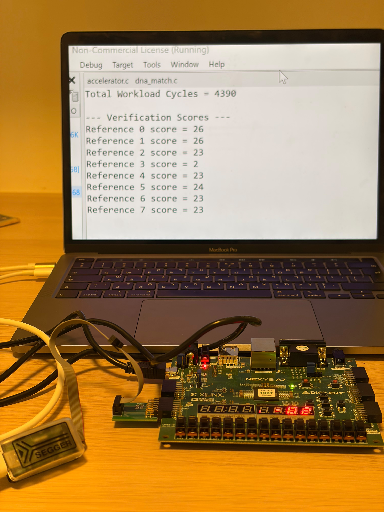

# 🚀 Smith-Waterman Hardware Accelerator on RISC-V

A hardware/software co-design project developed during a RISC-V Hackathon to accelerate the **Smith-Waterman DNA sequence alignment algorithm**.

## 🧬 The Challenge

Smith-Waterman is a Dynamic Programming algorithm used for local DNA sequence alignment. While highly accurate, it performs **millions of repetitive computations** and memory accesses, making it computationally expensive.

Our goal was simple:

> **Make Smith-Waterman significantly faster by combining software optimizations with a custom FPGA hardware accelerator.**

---

## 💡 Our Approach

Instead of jumping straight into hardware, we followed a **measure → optimize → accelerate** workflow.

### ⚡ Software Optimizations

- 🔄 **Rolling Rows** – reduced DP memory from full matrices to rolling buffers.
- 🔁 **Pointer Swapping** – eliminated unnecessary row copying.
- 🧬 **2-bit DNA Packing** – packed 16 DNA bases into a single 32-bit word, reducing memory footprint and communication overhead.

### 🖥️ Hardware Acceleration

After profiling the algorithm, we identified the main computational bottleneck and moved the **Dynamic Programming row computation** into a custom FPGA accelerator connected to the RISC-V processor through a **Wishbone Bus**.

The accelerator:

- Initializes DP buffers
- Computes complete DP rows in hardware
- Updates the best alignment score internally
- Returns the final score to the CPU

---

## 📈 Results

| Implementation | Clock Cycles |
|---|---:|
| Original Software | 1,157,276 |
| Final Hardware-Accelerated Version | **4,390** |

🎉 **263.6× Speedup**

📉 **99.62% reduction in clock cycles**

### 🔬 Hardware Validation

The final implementation was deployed and tested on a **Nexys A7 FPGA**.

The measured workload completed in **4,390 clock cycles** while producing the expected Smith-Waterman alignment scores.

*Final hardware-accelerated implementation running on the Nexys A7 FPGA, showing the measured 4,390-cycle workload and verification scores.*

---

## 🛠️ Technologies

- **RISC-V Processor**
- **Nexys A7 FPGA**
- **SystemVerilog**
- **C**
- **Xilinx Vivado**
- **Wishbone Bus**
- **PSP Performance Counters**

---

## 📚 Project Highlights

- Hardware/Software Co-Design
- FPGA-Based Algorithm Acceleration
- SystemVerilog RTL Development
- RISC-V Integration
- Dynamic Programming Acceleration
- Performance Profiling and Benchmarking
- Memory and Data Representation Optimization
- Hardware Validation

---

## 🏆 Performance Improvement

The project demonstrates the impact of combining software optimization with dedicated hardware acceleration.

Starting from an original software implementation requiring **1,157,276 clock cycles**, the final FPGA-accelerated implementation completed the same workload in only **4,390 clock cycles**.

This corresponds to approximately:

- **263.6× performance improvement**
- **99.62% fewer clock cycles**

---

*"Measure first. Optimize second. Accelerate last."* 🚀
